# Projeto Totem de Ar Condicionado Inteligente

## 📋 Descrição do Projeto

O **Totem de Ar Condicionado Inteligente** é um sistema de automação desenvolvido para ambientes acadêmicos que permite o controle democratizado de aparelhos de ar condicionado através de votações via bot do Telegram. O sistema monitora continuamente a qualidade do ar, fornecendo dados essenciais para manutenções preventivas e garantindo um ambiente confortável e saudável.

### Principais Funcionalidades

- **Controle por Votação**: Sistema democrático de controle via bot do Telegram
- **Monitoramento de Qualidade do Ar**: Sensores que coletam dados em tempo real
- **Gestão de Alunos**: Servidor web para cadastro e verificação de alunos, aulas, aparelhos, etc.
- **Visualização de Dados**: Dashboard interativo no Grafana para análise de métricas

### Potencial de Expansão

Embora desenvolvido inicialmente para o ambiente acadêmico, o projeto pode ser facilmente adaptado para:
- Escritórios corporativos
- Espaços de coworking
- Bibliotecas públicas
- Centros comunitários
- Qualquer ambiente compartilhado que necessite controle democrático de climatização

---

## 🏗️ Arquitetura do Sistema

O projeto utiliza uma arquitetura distribuída baseada em comunicação MQTT, processamento de dados com Node-RED e visualização através do Grafana.

### Componentes Principais

```
┌─────────────────┐      MQTT     ┌──────────────┐
│ ESP32 + Sensores│  ───────────► │   Node-RED   │
│  (Hardware)     │               │(Orquestrador)│
└─────────────────┘               └──────┬───────┘
                                         │
                    ┌────────────────────│
                    │                    │                    
              ┌─────▼─────┐       ┌─────▼─────┐        ┌─────▼─────┐
              │  Telegram │       │  Database │───────►│  Grafana  │                               
              │    Bot    │       │   (SQL)   │        │ Dashboard │
              └───────────┘       └───────────┘        └───────────┘
                                         ▲
                                         │
                                  ┌──────▼──────┐
                                  │   Servidor  │
                                  │   Flask     │
                                  │ (Cadastros) │
                                  └─────────────┘
```

### Fluxo de Dados

1. **Coleta de Dados**: O ESP32 equipado com sensores coleta dados de temperatura, umidade e qualidade do ar
2. **Comunicação MQTT**: Os dados são enviados via protocolo MQTT para o broker
3. **Processamento Node-RED**: Node-RED recebe os dados, processa regras de negócio e gerencia votações
4. **Armazenamento**: Dados são persistidos em banco de dados PostgreSQL
5. **Visualização**: Grafana consome os dados para exibição em dashboards
6. **Interação**: Usuários votam através do bot do Telegram
7. **Gestão**: Servidor Flask gerencia cadastros de alunos, salas, turmas e horários

### Tecnologias Utilizadas

- **Hardware**: ESP32, Sensores de qualidade do ar, Display Epaper, Sensor infravermelho e Placa de cobre para o circuito
- **Protocolo**: MQTT (Message Queuing Telemetry Transport)
- **Orquestração**: Node-RED
- **Backend**: Python Flask
- **Banco de Dados**: PostgreSQL
- **Visualização**: Grafana
- **Interface de Usuário**: Telegram Bot
- **Firmware**: PlatformIO (C++)

---

## 📡 MQTT (Message Queuing Telemetry Transport)

O protocolo MQTT é o núcleo da comunicação entre o hardware (ESP32) e o sistema de processamento. Ele foi escolhido por ser leve, eficiente e ideal para dispositivos IoT.

### Estrutura de Tópicos

O sistema utiliza uma hierarquia organizada de tópicos MQTT para gerenciar a comunicação:

```
arcondicionado/
├── dispositivos/
│   ├── 1, 2, 3, etc.     # Envia as novas temperaturas para os dispositivos
│   └── desconexao        # Para o dispositivo mandar seu número caso desconecte
└── enviaDados            # Para o envio dos dados dos sensores
```

### Exemplo de Payload

```json
{
  "timestamp": "2025-12-11T14:30:00Z",
  "temperatura": 24.5,
  "sala": "LET",
  "qualidade": "Bom",
  "codigo": "1"
}
```

### Configuração no ESP32

O ESP32 se conecta ao broker MQTT e publica dados dos sensores a cada 10 segundos, além de subscrever aos tópicos de controle para receber comandos em tempo real.

---

## 🔀 Node-RED

O Node-RED atua como o orquestrador central do sistema, processando dados, gerenciando lógica de negócio e coordenando a comunicação entre todos os componentes.

### Fluxos Principais


*Visualização dos fluxos principais do Node-RED.*

#### 1. Fluxo de Processamento de Sensores

```
[MQTT In] → [Validação] → [Transformação] → [Database] → [Grafana]
                                         ↓
                                   [Alertas]
```

- Recebe dados dos sensores via MQTT
- Valida e formata os dados
- Armazena no banco de dados PostgreSQL
- Envia para o Grafana
- Gera alertas quando valores críticos são detectados

#### 2. Fluxo de Votação do Telegram

```
[Telegram Bot] → [Validação Usuário] → [Contabilização] → [Decisão] → [MQTT Out]
                        ↓                                               ↓
                   [Database]                                    [Alterar temperatura]
```

- Recebe votos dos usuários via Telegram
- Valida se o usuário está cadastrado e tem aula no momento
- Contabiliza os votos (realiza a média de todos os votos)
- Toma decisão e envia comando via MQTT
- Registra a votação no banco de dados

### Funcionalidades Implementadas

- **Integração MQTT**: Nós de entrada/saída para comunicação com ESP32
- **Bot Telegram**: Gerenciamento completo de comandos e votações
- **Queries SQL**: Consultas ao PostgreSQL para validação e armazenamento
- **Lógica de Votação**: Algoritmo de contagem e decisão democrática
- **Notificações**: Alertas automáticos para usuários e administradores
- **Tratamento de Erros**: Logs e recuperação de falhas

### Importação dos Fluxos

Os fluxos completos estão disponíveis em `nodered-flows/flows.json`. Para importá-los:

1. Acesse o Node-RED (geralmente em `http://localhost:1880`)
2. Menu → Import → Clipboard
3. Cole o conteúdo do arquivo `flows.json`
4. Configure as credenciais (Telegram Token, MQTT, Database)

---

## 🗄️ Banco de Dados (PostgreSQL)

O PostgreSQL é utilizado para persistir todos os dados do sistema, desde cadastros até histórico de sensores e votações.

### Diagrama Entidade-Relacionamento

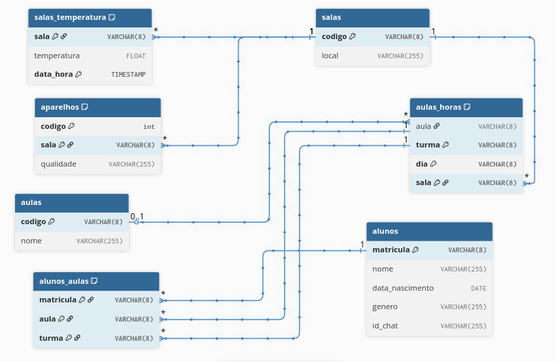

*Modelo de dados do sistema.*

### Estrutura das Tabelas Principais

#### 1. Tabela: `alunos`
```sql
CREATE TABLE alunos (
    matricula VARCHAR(8) PRIMARY KEY,
    nome VARCHAR(255) NOT NULL,
    data_nascimento DATE,
    genero VARCHAR(255),
    id_chat VARCHAR(255)  -- ID do chat do Telegram
);
```
*Armazena informações dos alunos cadastrados no sistema, incluindo seus identificadores do Telegram para votações.*

#### 2. Tabela: `salas`
```sql
CREATE TABLE salas (
    codigo VARCHAR(8) PRIMARY KEY,
    local VARCHAR(255) NOT NULL
);
```
*Cadastro das salas/ambientes onde os aparelhos estão instalados.*

#### 3. Tabela: `aparelhos`
```sql
CREATE TABLE aparelhos (
    codigo INT,
    sala VARCHAR(8) REFERENCES salas(codigo),
    qualidade VARCHAR(255), -- Ex: 'Bom', 'Ruim'
    PRIMARY KEY (codigo, sala)
);
```
*Registro dos dispositivos/aparelhos de ar condicionado disponíveis no sistema.*

#### 4. Tabela: `aulas`
```sql
CREATE TABLE aulas (
    codigo VARCHAR(8) PRIMARY KEY,
    nome VARCHAR(255)
);
```
*Registro das aulas no sistema.*

#### 5. Tabela: `aulas_horas`
```sql
CREATE TABLE aulas_horas (
    aula VARCHAR(8) REFERENCES aulas(codigo),
    turma VARCHAR(8),
    dia VARCHAR(8),
    sala VARCHAR(8) REFERENCES salas(codigo)
    PRIMARY KEY (sala, turma, dia)
);
```
*Define as aulas programadas, associando salas, turmas e dias da semana*

#### 6. Tabela: `alunos_aulas`
```sql
CREATE TABLE alunos_aulas (
    matricula VARCHAR(8) REFERENCES alunos(matricula),
    aula VARCHAR(8) REFERENCES aulas_horas(aula),
    turma VARCHAR(8) REFERENCES aulas_horas(turma),
    PRIMARY KEY (matricula, aula, turma)
);
```
*Relaciona alunos às suas aulas, permitindo validação de participação em votações.*

#### 7. Tabela: `salas_temperatura`
```sql
CREATE TABLE salas_temperatura (
    sala VARCHAR(8) REFERENCES salas(codigo),
    temperatura FLOAT NOT NULL,
    data_hora TIMESTAMP DEFAULT CURRENT_TIMESTAMP,
    PRIMARY KEY (sala, data_hora)
);
```
*Armazena histórico de leituras de temperatura por sala, coletadas pelos sensores dos aparelhos.*

### Conexão com o Sistema

- **Servidor Flask**: Utiliza psycopg para ORM
- **Node-RED**: Conexão direta via nó PostgreSQL
- **Grafana**: Data source PostgreSQL para dashboards

---

## 🔌 Esquemático do Circuito

### Diagrama Esquemático

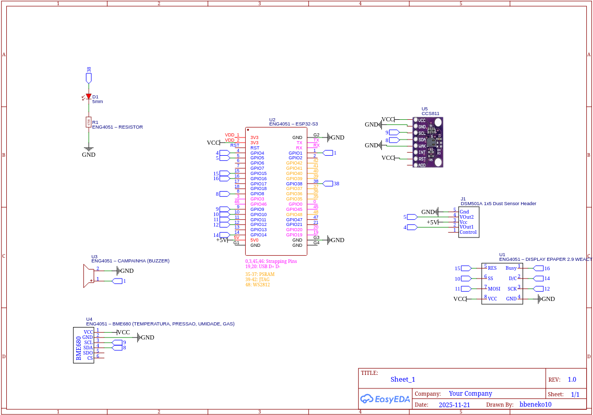

*Esquemático desenvolvido no EasyEDA mostrando as conexões do ESP32 com os sensores e módulos.*

### Componentes Eletrônicos

- **Microcontrolador**: ESP32
- **Sensores**: 
  - Sensor de temperatura e umidade (BME280)
  - Sensor de qualidade do ar (CCS811)
  - Sensor de partículas (DSM501A)
  - Sensor infravermelhor para controlar o aparelho
- **Comunicação**: Módulo Wi-Fi integrado no ESP32
- **Alimentação**: Regulador de tensão 5V/3.3V
- **Interface**: Display Epaper

---

## 📟 Placa de Circuito Impresso (PCB)

### Vista Frontal da Placa

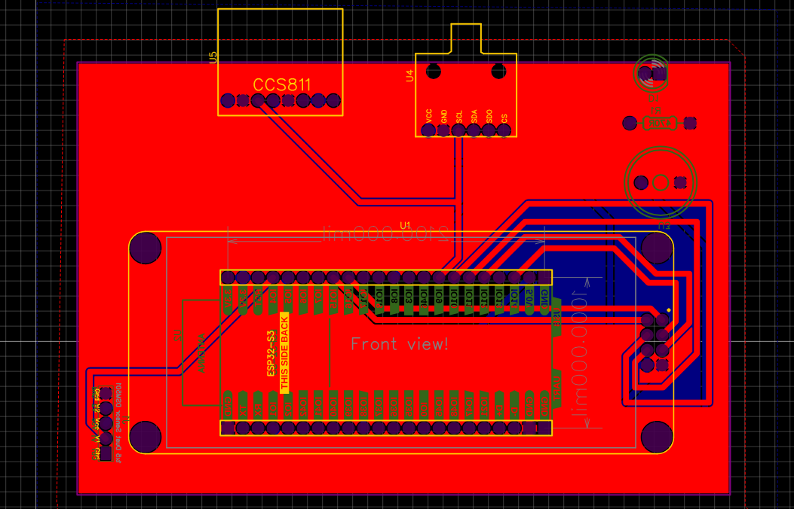
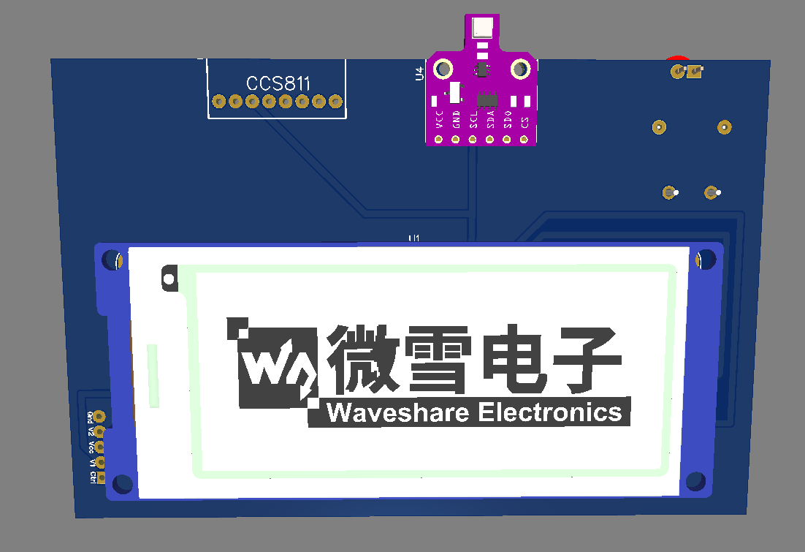

*Camada superior da placa com componentes SMD e through-hole.*

### Vista Posterior da Placa

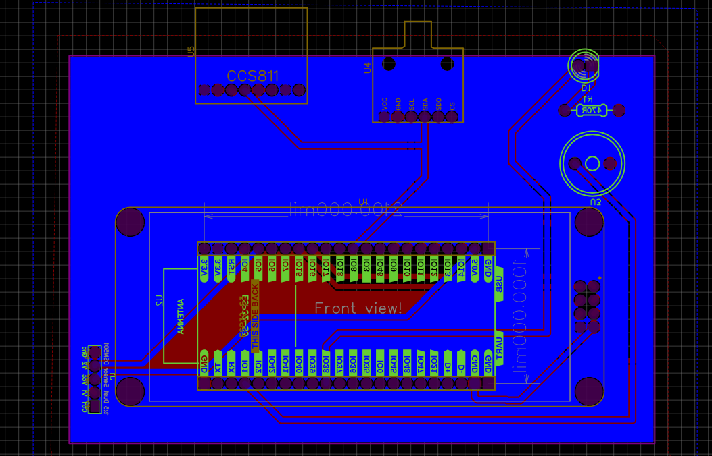
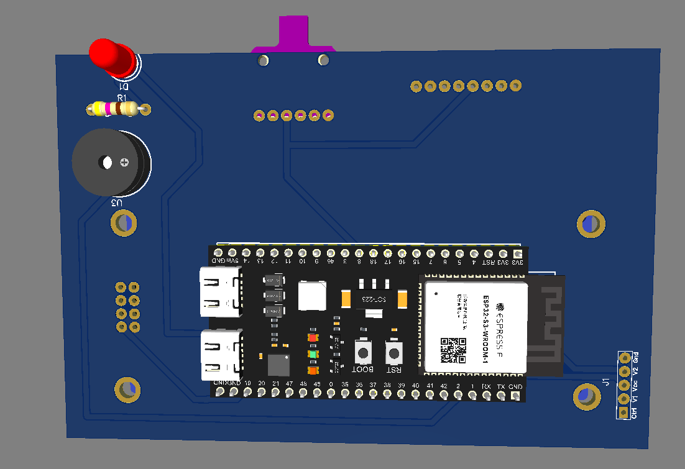

*Camada inferior mostrando as trilhas e plano de terra.*

---

## 📊 Dashboards e Visualizações

### Dashboard Principal - Monitoramento em Tempo Real

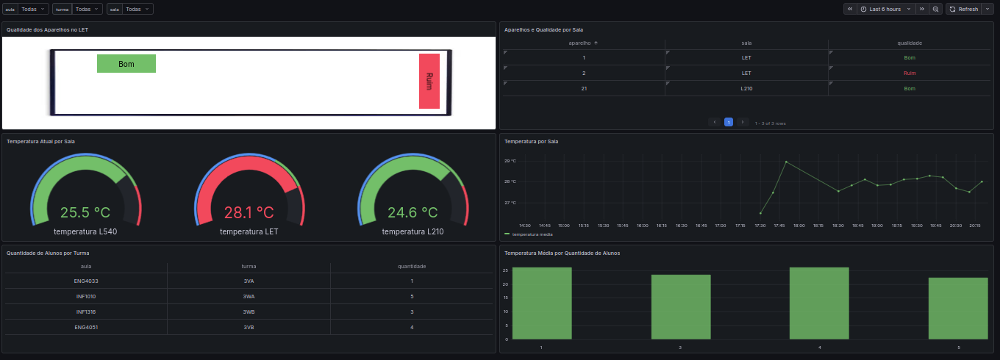

*Visão geral com métricas de temperatura e qualidade do ar em tempo real.*

### Dashboard de Manutenção

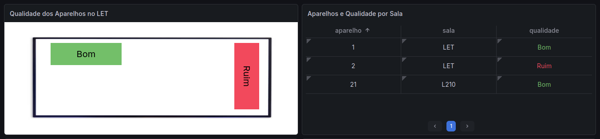

*Indicadores de qualidade do ar e alertas para manutenção preventiva.*

### Dashboard de Temperatura

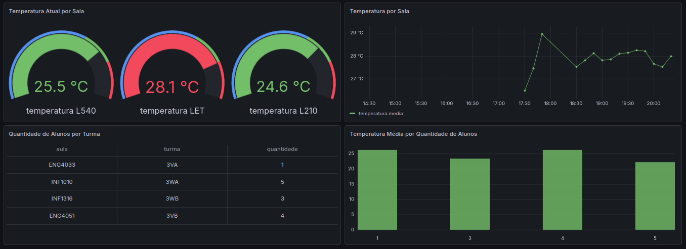

*Histórico de temperaturas.*

### Interface do Servidor de Cadastros

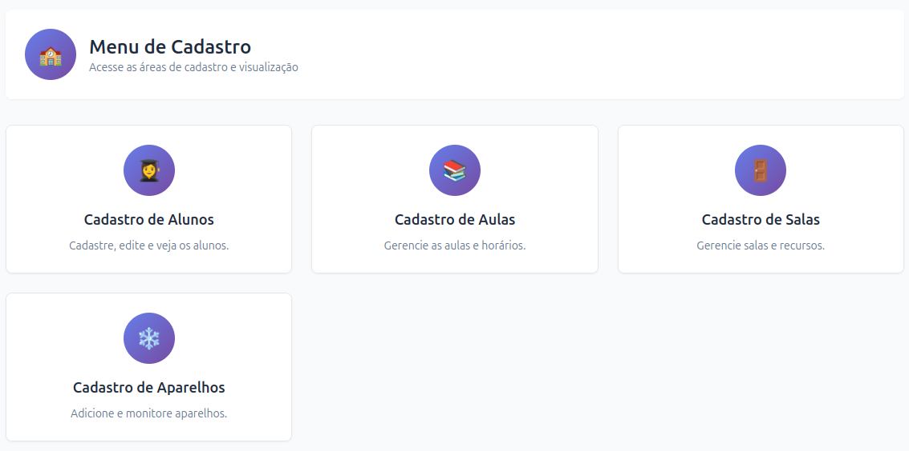

*Interface web para gerenciamento de alunos, turmas, salas e horários.*

### Formulários de Cadastro e Edição

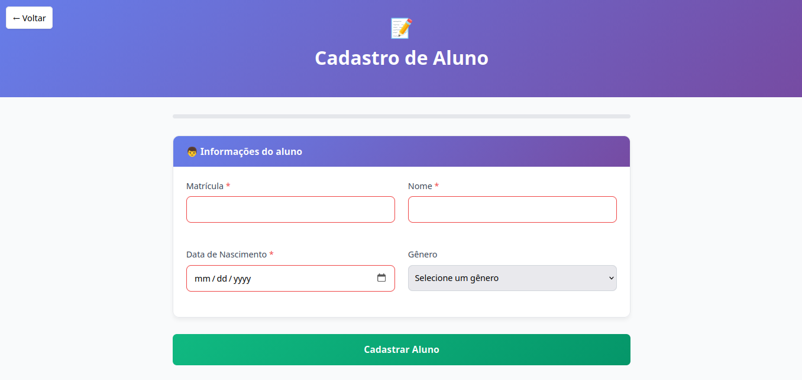
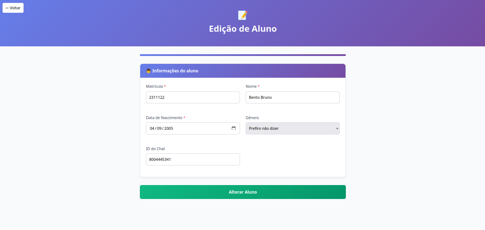

*Interface web para cadastro e edição.*

### Página de Listagem de Itens

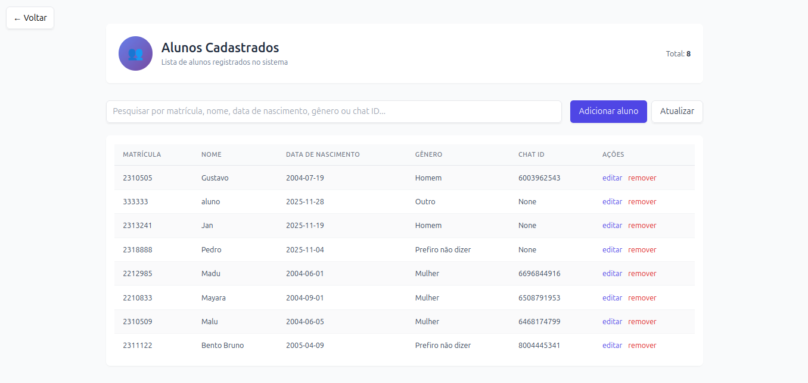

*Interface web para listar todos os itens de uma categoria.*

---

## 🌐 Servidor Web Flask

O servidor Flask fornece uma interface web completa para gerenciamento administrativo do sistema, permitindo o cadastro e manutenção de todos os dados necessários para o funcionamento do totem.

### Funcionalidades Principais

#### Gestão de Alunos
- **Cadastro**: Adicionar novos alunos com matrícula, nome, data de nascimento e gênero
- **Edição**: Atualizar informações dos alunos cadastrados
- **Exclusão**: Remover alunos do sistema
- **Listagem**: Visualizar todos os alunos registrados
- **Vinculação**: Associar alunos às suas respectivas turmas e aulas

#### Gestão de Aulas
- **Criação**: Cadastrar novas aulas com código e nome
- **Configuração de Horários**: Definir cada turma, com sua sala e dia
- **Edição**: Modificar informações das aulas existentes
- **Exclusão**: Remover aulas do sistema
- **Visualização**: Listar todas as aulas cadastradas

#### Gestão de Salas
- **Cadastro**: Adicionar salas com código e localização
- **Edição**: Atualizar informações das salas
- **Exclusão**: Remover salas do banco de dados
- **Associação**: Vincular salas aos aparelhos de ar condicionado

#### Gestão de Aparelhos
- **Registro**: Cadastrar novos aparelhos com código e sala
- **Atualização**: Modificar informações dos aparelhos
- **Monitoramento**: Visualizar status e qualidade dos dispositivos
- **Exclusão**: Remover aparelhos do sistema

### Arquitetura do Servidor

```python
# Conexão com PostgreSQL
conn = psycopg.connect(
    dbname = "projeto_b", 
    user = os.getenv("DB_LOGIN"), 
    host = os.getenv("DB_ADDRESS"),
    password = os.getenv("DB_PASSWORD"),
    port = os.getenv("DB_PORT")
)
```

### Principais Rotas da API

| Rota | Método | Descrição |
|------|--------|-----------|
| `/` | GET | Página inicial do sistema |
| `/alunos` | GET | Interface de gestão de alunos |
| `/alunos/add` | GET/POST | Adicionar novo aluno |
| `/alunos/edit2` | GET/POST | Editar dados do aluno |
| `/alunos/delete` | POST | Remover aluno |
| `/alunos/get` | GET | Listar todos os alunos |
| `/alunos/turmas/edit2` | GET/POST | Vincular aluno a turmas |
| `/aulas` | GET | Interface de gestão de aulas |
| `/aulas/add` | GET/POST | Adicionar nova aula |
| `/aulas/edit2` | GET/POST | Editar dados da aula |
| `/aulas/edit` | GET/POST | Cadastrar uma turma |
| `/aulas/delete` | POST | Remover aula |
| `/aulas/get` | GET | Listar todas as aulas |
| `/aulas/get2` | GET | Listar todas as turmas |
| `/turmas/edit` | GET/POST | Editar dados da turma |
| `/salas` | GET | Interface de gestão de salas |
| `/salas/add` | GET/POST | Adicionar nova sala |
| `/salas/edit2` | GET/POST | Editar dados da sala |
| `/salas/delete` | POST | Remover sala |
| `/salas/get` | GET | Listar todas as salas |
| `/aparelhos` | GET | Interface de gestão de aparelhos |
| `/aparelhos/add` | GET/POST | Adicionar novo aparelho |
| `/aparelhos/edit2` | GET/POST | Editar dados do aparelho |
| `/aparelhos/delete` | POST | Remover aparelho |
| `/aparelhos/get` | GET | Listar todas os aparelhos |

### Tecnologias Utilizadas

- **Framework**: Flask 3.1.2
- **Database Driver**: psycopg (PostgreSQL adapter)
- **Flash Messages**: Sistema de feedback para operações CRUD

### Sistema de Templates

O servidor utiliza templates HTML, localizados em `python/templates/`:

```
templates/
├── home_page.html           # Página inicial
├── alunos_page.html         # Dashboard de alunos
├── alunos_add.html          # Formulário de cadastro
├── alunos_edit2.html        # Formulário de edição
├── alunos_edit.html         # Formulário de edição
├── alunos_get.html          # Listagem de alunos
├── alunos_turmas_edit2.html # Vinculação aluno-turma
├── aulas_page.html          # Dashboard de aulas
├── aulas_add.html           # Cadastro de aulas
├── aulas_edit2.html         # Edição de aulas
├── aulas_get.html           # Listagem de aulas
├── salas_page.html          # Dashboard de salas
├── salas_add.html           # Cadastro de salas
├── salas_edit2.html         # Edição de salas
├── salas_get.html           # Listagem de salas
├── aparelhos_page.html      # Dashboard de aparelhos
├── aparelhos_add.html       # Cadastro de aparelhos
├── aparelhos_edit2.html     # Edição de aparelhos
└── aparelhos_get.html       # Listagem de aparelhos
```

### Configuração e Execução

#### Variáveis de Ambiente (.env)

```env
DB_LOGIN=seu_usuario
DB_ADDRESS=seu_servidor
DB_PASSWORD=sua_senha
DB_PORT=sua_porta
```

#### Instalação de Dependências

```bash
cd python
pip install -r requirements.txt
```

**Nota**: O driver `psycopg` requer um compilador C instalado no sistema. Testado com sucesso em Linux e Windows.

#### Executar o Servidor

```bash
python main.py
```

### Tratamento de Erros

O sistema implementa tratamento de exceções para operações de banco de dados, exibindo mensagens amigáveis através do sistema de flash messages:

```python
try:
    cur.execute('DELETE FROM alunos WHERE matricula = %s;', (matricula,))
    conn.commit()
    flash('Aluno removido com sucesso', 'success')
except Exception as e:
    conn.rollback()
    flash('Erro ao remover aluno', 'error')
```

### Integração com o Sistema

O servidor Flask se integra ao ecossistema do projeto:

- **Banco de Dados**: Lê e escreve diretamente no PostgreSQL
- **Node-RED**: O Node-RED consulta o banco para validar usuários em votações
- **Telegram Bot**: Utiliza o `id_chat` cadastrado para identificar usuários
- **Grafana**: Os dados cadastrados contextualizam as visualizações nos dashboards

---
## 🎥 Demonstração em Vídeo

<div align="center">
  <iframe 
    width="800" 
    height="450" 
    src="https://www.youtube.com/embed/Syz3W9gTWlo?si=bdf79xZYuxsVmA0S" 
    title="Demonstração do Projeto Totem de Ar Condicionado Inteligente" 
    frameborder="0" 
    allow="accelerometer; autoplay; clipboard-write; encrypted-media; gyroscope; picture-in-picture; web-share" 
    referrerpolicy="strict-origin-when-cross-origin" 
    allowfullscreen>
  </iframe>
</div>

*Vídeo demonstrando o funcionamento completo do sistema, desde a votação no Telegram até a ativação do ar condicionado e visualização no Grafana.*

---

## 🚀 Como Executar o Projeto

### Pré-requisitos

- PlatformIO (para firmware do ESP32)
- Python 3.8+
- Node-RED
- Grafana
- PostgreSQL
- Broker MQTT (Mosquitto)

### Configuração do Hardware

1. Grave o firmware no ESP32 usando PlatformIO
2. Configure as credenciais Wi-Fi e certificados em `include/certificados.h`
3. Conecte os sensores conforme o esquemático

### Configuração do Software

1. **Banco de Dados**: Execute os scripts de criação do banco
2. **Node-RED**: Importe o flow de `nodered-flows/flows.json`
3. **Servidor Flask**: 
   ```bash
   cd python
   pip install -r requirements.txt
   python main.py
   ```
4. **Grafana**: Configure as dashboards e data sources
5. **Telegram Bot**: Configure o token do bot no Node-RED

---

**Desenvolvido com ❤️ para tornar ambientes compartilhados mais confortáveis e eficientes.**
